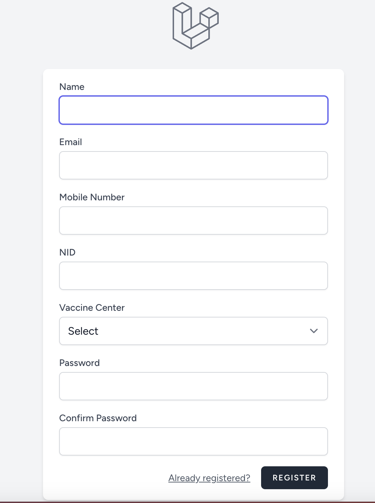
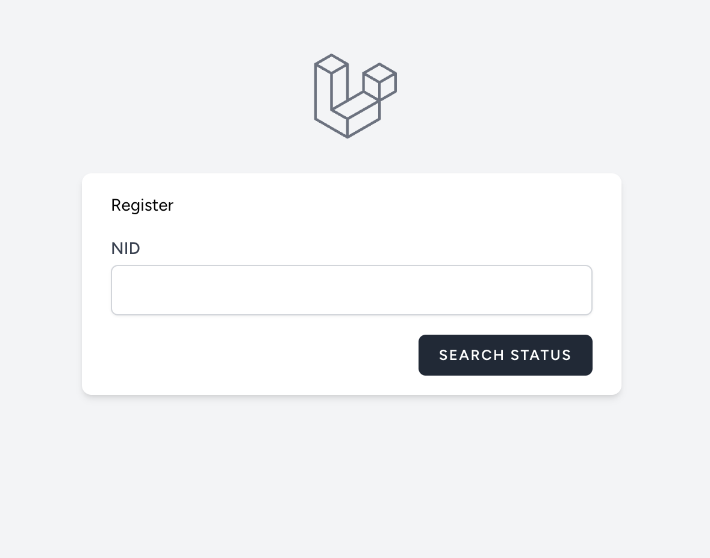
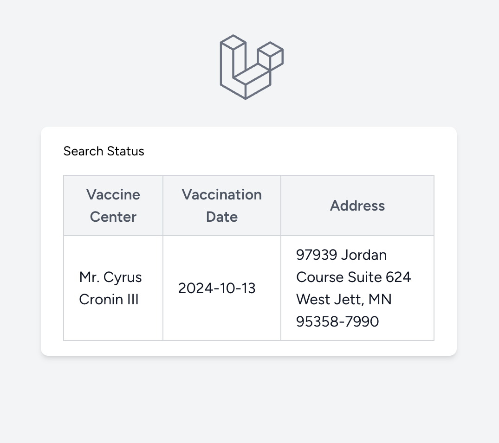

## Project installation instruction

### Demo

#### Register Page

#### Search Page

#### Search Result Page

### Tools & Tech stack used
- Laravel 11 (back-end)
- Blade.php (front-end)
- Tailwind 2.2 CSS
- MySQL 8 (Database)
- Docker (nginx, php-fpm, mysql, redis, scheduler)

### Run Laravel Project
    git clone https://github.com/riad1302/covid-vaccine-registration.git
    cd covid-vaccine-registration/docker
    cp .env.example .env
    cp docker-compose.override.example.yml docker-compose.override.yml
    cd .envs/
    cp mysql.env.example mysql.env
    cp php-ini.env.example php-ini.env
    cp redis.env.example redis.env
    docker network create kahf-net
    docker-compose build
    docker-compose up -d
    docker-compose exec -it app composer install
    docker-compose exec -it app php artisan key:generate
    docker-compose exec -it app php artisan migrate
    docker-compose exec -it app php artisan test
    docker-compose exec -it app php artisan db:seed

### Check Application
    http://localhost:8000/

### Performance Optimizations

#### User Registration

To ensure a fast and seamless user registration experience, we have optimized the process by offloading time-consuming tasks to background jobs. Specifically:

- **Vaccination Date Generation:** The generation of vaccination dates can take a significant amount of time. To avoid making users wait during registration, this task is handled asynchronously using a queue (e.g., Laravel Queues). The user is registered immediately, while the vaccination date is generated in the background.

#### Future Optimizations:

- **Database Indexing:**  Adding proper indexes to the user and vaccination tables could further improve performance.

#### Search Functionality
The search functionality has been optimized for speed by caching relevant data using Redis. This reduces the need for repetitive database queries, making searches significantly faster.

- **Redis Caching:** Vaccination status and other frequently searched data are cached in Redis, allowing for near-instant search responses. Additionally, cache expiry policies have been implemented, with vaccination status data and other frequently searched information stored in Redis for up to 2 months.

#### Future Optimizations:

- **Database Sharding:** For extremely large datasets, consider sharding the database to distribute the load across multiple servers. This would help balance the search load more efficiently as the number of users and searches grows.

### Future Enhancement: Adding SMS Notification for Vaccination Schedule

If the requirement to send an SMS notification along with the email for vaccination schedule dates arises, the following changes should be made to the current implementation:

-  Modify the **VaccinationDateNotifyJob** Class:
   - Add SMS sending logic in the handle() method alongside the existing email notification logic.